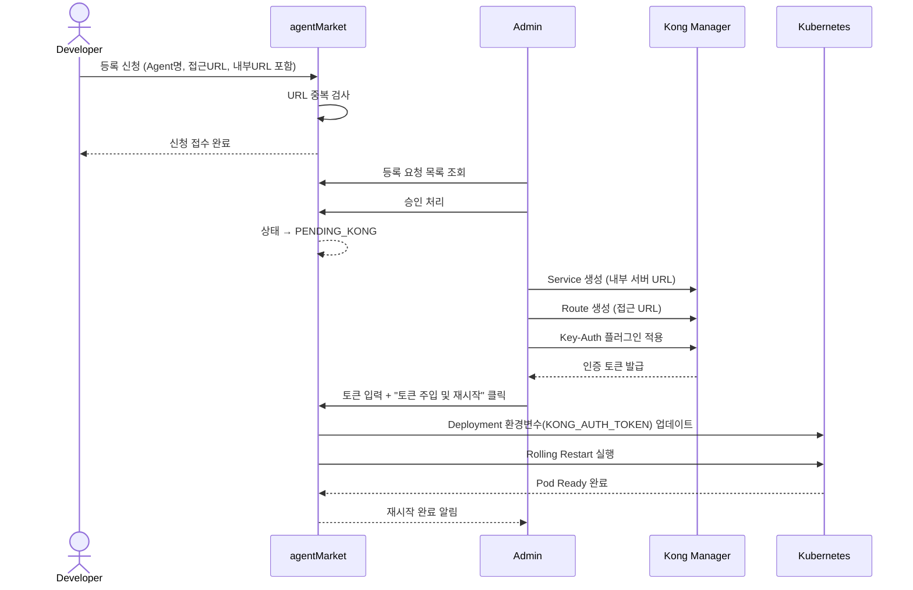
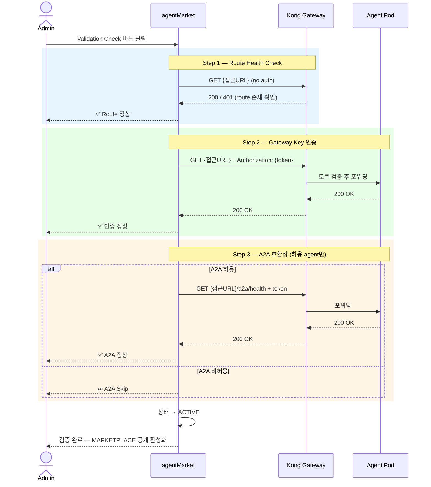
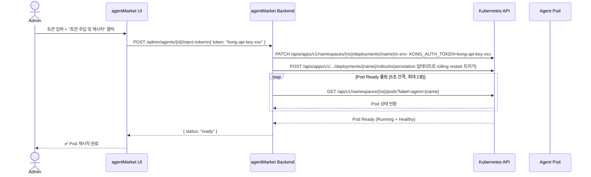
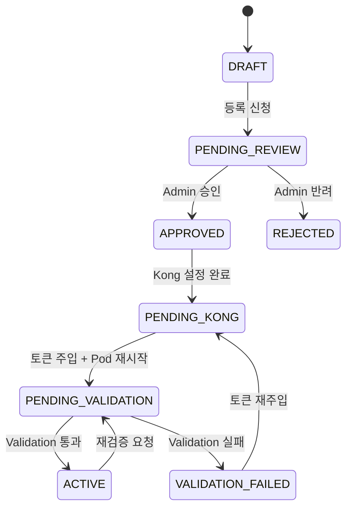

# Kong Gateway 연동 및 Agent Validation 요건 정의서

---

## 1. 개요

Agent 등록 시 사용자가 **접근 URL을 직접 지정**하고, Kong Manager에서 발급한 **인증 토큰을 agent pod에 주입**하여 재시작함으로써 Kong Gateway를 통한 라우팅을 활성화한다.  
이후 **Validation Check** 버튼으로 전체 파이프라인이 정상 동작하는지 3단계 검증을 수행한다.

---

## 2. 전체 흐름 요약

```
개발자 등록 신청 (URL 포함)
  → Admin 승인
  → Admin: Kong Manager에서 Service/Route 생성 + 인증토큰 발급
  → Admin: 토큰을 agent pod 환경변수에 주입 + pod 재시작
  → Admin: Validation Check (3단계 검증)
  → 검증 통과 → agentMarket MARKETPLACE 공개
```

---

## 3. 요건 정의

### 3-1. Agent 등록 신청 (Developer)

| 항목 | 타입 | 필수 | 설명 |
|------|------|------|------|
| Agent 이름 | text | ✅ | 중복 확인 필수 |
| **Agent 접근 URL** | text | ✅ | Kong Route에 등록될 외부 접근 경로 (예: `/api/my-agent`) |
| **내부 서버 URL** | text | ✅ | Kong Upstream이 바라볼 실제 pod 주소 (예: `http://10.0.1.5:8080`) |
| 보안등급 | select | ✅ | L0 / L1 / L3 |
| A2A 허용 여부 | toggle | ✅ | Agent-to-Agent 체이닝 허용 여부 |
| 과제번호, 보안성 검토 ID 등 | text | ✅ | 기존 항목 유지 |

> **접근 URL 규칙**  
> - 중복 불가 (agentMarket 내 전체 agent URL 기준)  
> - 소문자, 숫자, 하이픈(-), 슬래시(/) 만 허용  
> - 예시: `/agents/finance-bot`, `/agents/hr-assistant`

---

### 3-2. Admin — Kong 설정 및 토큰 주입

| 단계 | 주체 | 행위 | 비고 |
|------|------|------|------|
| 1 | Admin | 등록 요청 검토 후 **승인** | 승인 시 Kong 설정 UI 활성화 |
| 2 | Admin | Kong Manager에서 **Service** 생성 | Upstream: 개발자가 입력한 내부 서버 URL |
| 3 | Admin | Kong Manager에서 **Route** 생성 | Path: 개발자가 입력한 접근 URL |
| 4 | Admin | Kong Manager에서 **인증 플러그인 적용** → **토큰 발급** | Key-Auth 또는 JWT 플러그인 |
| 5 | Admin | agentMarket UI에서 **토큰 입력** → **pod 주입 실행** | 아래 3-3 참고 |
| 6 | Admin | **Validation Check** 버튼 클릭 | 아래 3-4 참고 |

---

### 3-3. Token 주입 및 Pod 재시작

Admin이 agentMarket UI에서 수행:

| UI 요소 | 설명 |
|---------|------|
| Kong 인증 토큰 입력 필드 | Kong Manager에서 복사한 API Key 또는 JWT Secret |
| Pod 재시작 대상 선택 | agent 이름으로 자동 식별 (Kubernetes label selector 기준) |
| "토큰 주입 및 재시작" 버튼 | 아래 동작 수행 |

**버튼 클릭 시 동작 (백엔드 처리)**:
1. Kubernetes API — 해당 Deployment의 환경변수(`KONG_AUTH_TOKEN`) 업데이트  
2. Kubernetes API — Rolling Restart (`kubectl rollout restart`) 실행  
3. Pod Ready 상태 폴링 → UI에 완료 표시

---

### 3-4. Validation Check (3단계 검증)

Admin이 "Validation Check" 버튼 클릭 시 모달에서 순차 실행:

| 단계 | 검증 항목 | 성공 조건 | 실패 처리 |
|------|----------|----------|---------|
| **Step 1** | Kong Route Health Check | 지정된 접근 URL로 `GET` 요청 → `200` or `401` 응답 수신 | Kong 미등록 / 네트워크 단절 → 실패 표시 후 중단 |
| **Step 2** | Gateway Key 인증 | 주입된 토큰으로 인증 요청 → `200` 응답 수신 | 인증 실패(401/403) → 재주입 안내 |
| **Step 3** | A2A 호환성 확인 | A2A 허용 agent: `/a2a/health` 엔드포인트 응답 확인 | A2A 비허용 agent: **Skip** |

검증 완료 후:
- **전체 통과** → agent 상태를 `ACTIVE`로 변경, MARKETPLACE 노출 활성화
- **일부 실패** → 실패 단계 표시, 원인 메시지 출력, MARKETPLACE 노출 보류

---

## 4. 시퀀스 다이어그램

### 4-1. Agent 등록 ~ Kong 설정 흐름



---

### 4-2. Validation Check 흐름



---

### 4-3. Token 주입 및 Pod 재시작 상세 흐름



---

## 5. 상태 전이 정의

```
DRAFT              → 개발자 작성 중
PENDING_REVIEW     → 등록 신청 완료, Admin 검토 대기
APPROVED           → Admin 승인 완료, Kong 설정 대기
PENDING_KONG       → Kong Service/Route 생성 완료, 토큰 주입 대기
PENDING_VALIDATION → 토큰 주입 및 pod 재시작 완료, Validation 대기
ACTIVE             → Validation 통과, MARKETPLACE 공개
REJECTED           → 반려
VALIDATION_FAILED  → Validation 실패, 원인 수정 후 재시도 가능
```



---

## 6. UI 변경 사항 요약

### 등록 신청 패널 (`apply`) — 추가 필드

| 필드 | 입력 유형 | 검증 |
|------|----------|------|
| 접근 URL | text (`/agents/...` prefix 강제) | 중복 확인 버튼 필수 |
| 내부 서버 URL | text (`http://` 형식) | URL 형식 검사 |

### 등록 승인 패널 (`approve`) — 상태별 액션 버튼

| 상태 | 표시 버튼 |
|------|----------|
| APPROVED | "Kong 설정 완료 처리" (수동 확인용) |
| PENDING_KONG | "토큰 입력 및 주입" 폼 + "pod 재시작" 버튼 |
| PENDING_VALIDATION | "Validation Check" 버튼 |
| VALIDATION_FAILED | 실패 원인 + "재시도" 버튼 |
| ACTIVE | 상태 표시만 |

### Validation 모달 — 단계별 UI

```
┌─────────────────────────────────────────────┐
│  Validation Check — finance-bot             │
├─────────────────────────────────────────────┤
│  Step 1  Route Health Check      ✅ 완료    │
│          GET /agents/finance-bot → 401      │
│                                             │
│  Step 2  Gateway Key 인증        ⏳ 진행중  │
│          Authorization 헤더 검증 중...      │
│                                             │
│  Step 3  A2A 호환성              ⬜ 대기    │
│                                             │
│                          [닫기] [재시도]    │
└─────────────────────────────────────────────┘
```

---

## 7. 구현 단계 제안

| 단계 | 내용 | 우선순위 |
|------|------|---------|
| **Phase 1** | 등록 신청 폼에 URL 필드 추가 + 중복 검사 API | 높음 |
| **Phase 2** | Admin 승인 후 토큰 입력 UI + K8s 주입 API | 높음 |
| **Phase 3** | Validation Check 모달 (3단계 순차 실행) | 높음 |
| **Phase 4** | 상태 전이 관리 (DB 상태 컬럼) + MARKETPLACE 노출 연동 | 중간 |
| **Phase 5** | Pod 재시작 상태 폴링 → WebSocket/SSE 실시간 반영 | 낮음 |
