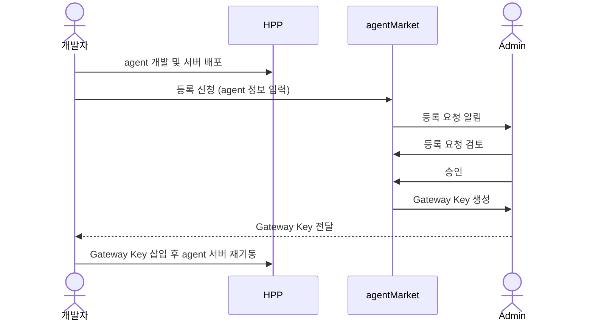
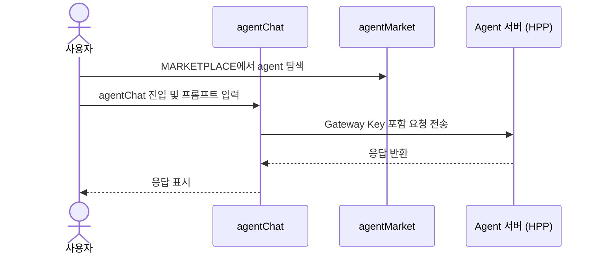
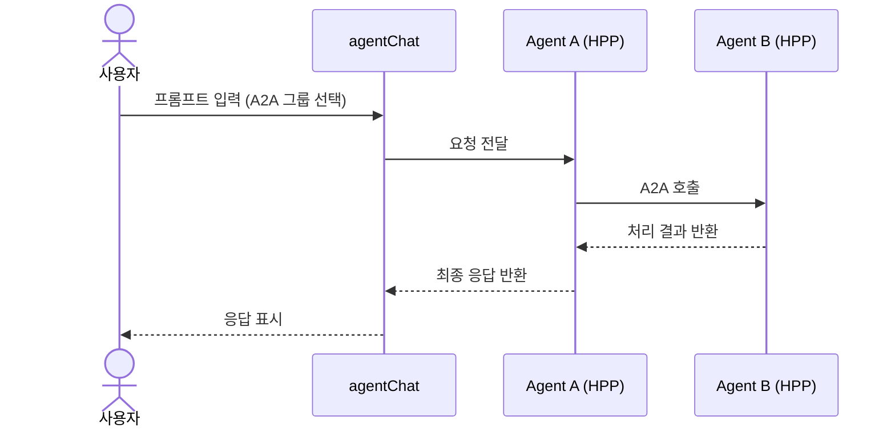
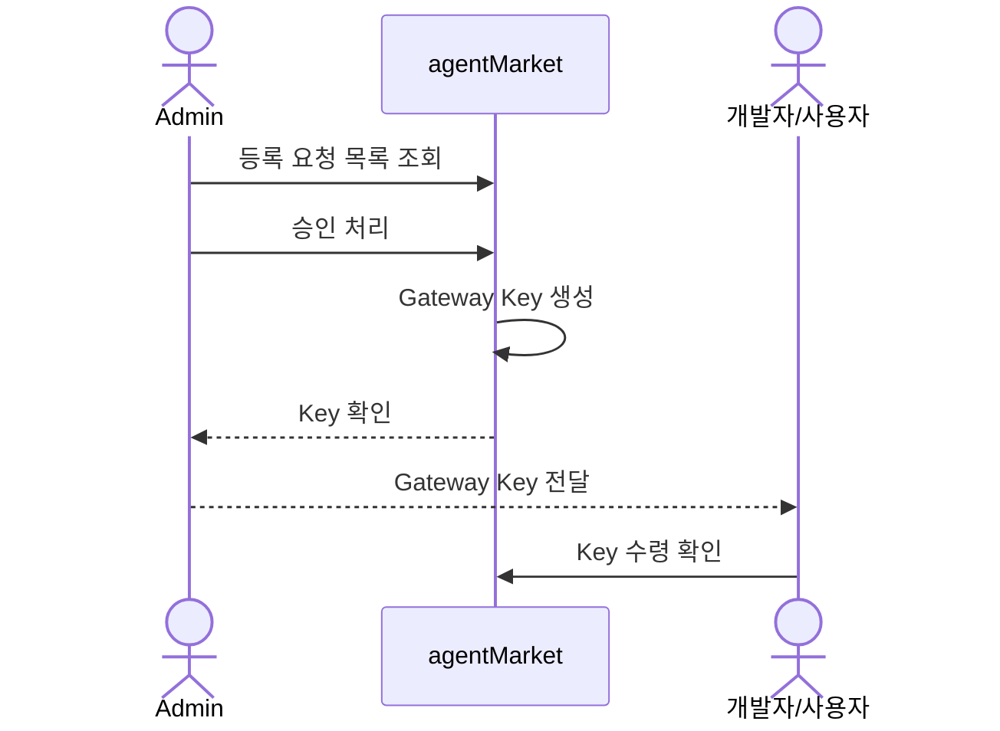

# 프로세스 정의서 — Agent 플랫폼 (HPP / agentMarket / agentChat)

---

## 1. 시스템 개요

| 시스템 | 역할 |
|--------|------|
| **HPP** | 개발자가 클라우드 자원을 할당받아 agent를 개발·배포하는 Ops 플랫폼 |
| **agentMarket** | HPP에서 개발한 agent를 등록·관리·승인하는 플랫폼 |
| **agentChat** | agentMarket에 등록된 agent를 사용자가 직접 사용하는 프롬프트 UI |

---

## 2. 역할 정의

| 역할 | 설명 |
|------|------|
| **개발자** | HPP에서 agent를 개발하고 agentMarket에 등록 신청 |
| **일반 사용자** | agentMarket MARKETPLACE에서 agent를 탐색하고 agentChat으로 사용 |
| **Admin** | agent 등록 요청 승인, Gateway Key 발급, Milvus 컬렉션 관리 |

---

## 3. 프로세스 정의

### 3-1. Agent 등록 프로세스

| 단계 | 주체 | 행위 | 비고 |
|------|------|------|------|
| 1 | 개발자 | HPP에서 agent 개발 및 서버 배포 | 클라우드 자원 할당 후 진행 |
| 2 | 개발자 | agentMarket 등록 신청 화면에서 정보 입력 | 아래 입력 항목 참고 |
| 3 | 개발자 | 등록 신청 버튼 클릭 → 검토 요청 전송 | |
| 4 | Admin | 등록 요청 목록에서 신청 내용 검토 | agentMarket Admin 탭 |
| 5 | Admin | 승인 처리 | |
| 6 | Admin | Gateway Key 발급 → 개발자/사용자에게 전달 | agent 접근 인증 키 |
| 7 | 개발자 | 발급받은 Gateway Key를 HPP agent 서버에 삽입 후 재기동 | |

#### 등록 신청 입력 항목

| 항목 | 설명 |
|------|------|
| Agent 이름 | 중복 확인 필수 |
| 과제번호 | - |
| 시스템 계정 | - |
| 보안성 검토 ID | - |
| 부문 | - |
| Agent 설명 | - |
| 팀명 / 담당자 | - |
| Agent Owner | - |
| MPRS 구분 / 태그 | - |
| Agent 카테고리 | 선택 |
| 공개 설정 | Agent Market 공개 여부, A2A 사용 여부 |

---

### 3-2. Agent 사용 프로세스 (agentChat)

| 단계 | 주체 | 행위 |
|------|------|------|
| 1 | 사용자 | agentMarket MARKETPLACE에서 agent 탐색 |
| 2 | 사용자 | agentChat 화면 진입 |
| 3 | 사용자 | 프롬프트 입력 |
| 4 | agentChat | Gateway Key로 agent 호출 |
| 5 | agent (HPP) | 요청 처리 후 응답 반환 |
| 6 | agentChat | 응답 화면에 표시 |

---

### 3-3. Admin 관리 프로세스

| 기능 | 설명 |
|------|------|
| 등록 요청 검토 | 사용자/개발자가 신청한 agent 목록 확인 및 승인/반려 |
| Gateway Key 발급 | 승인된 agent에 대해 접근 키 생성 후 신청자에게 전달 |
| Milvus 컬렉션 관리 | 각 agent가 사용 중인 Milvus collection 목록 조회 |

---

## 4. 시퀀스 다이어그램

### 4-1. Agent 등록 흐름

---

### 4-2. Agent 사용 흐름 (agentChat — 단일 agent)

---

### 4-3. Agent 사용 흐름 (agentChat — A2A)

---

### 4-4. Admin — Gateway Key 발급 흐름

